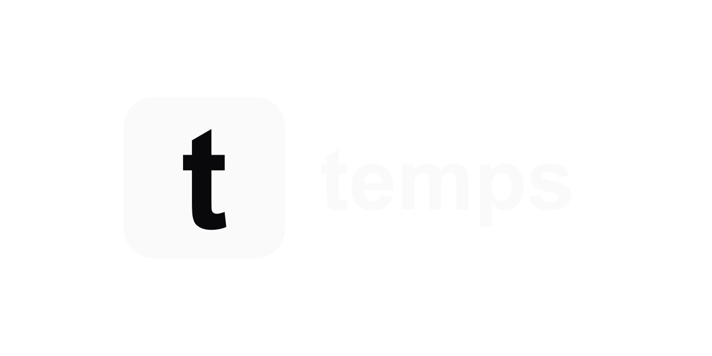
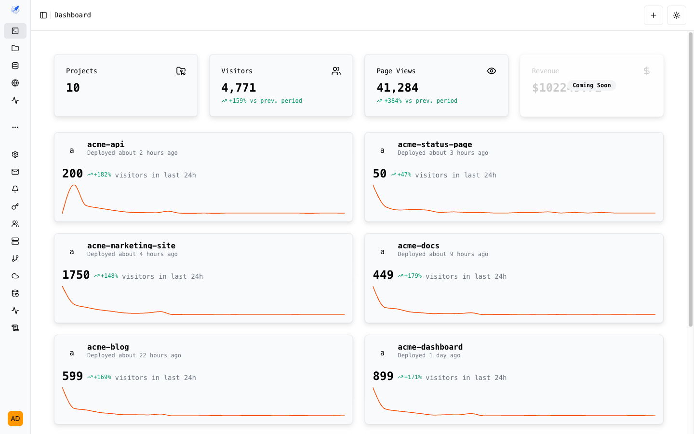
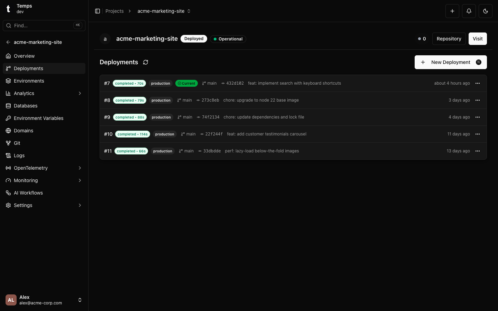
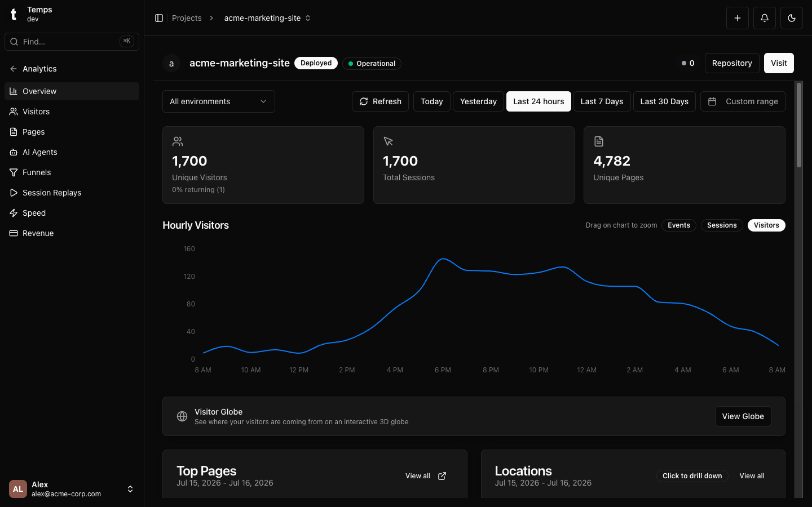
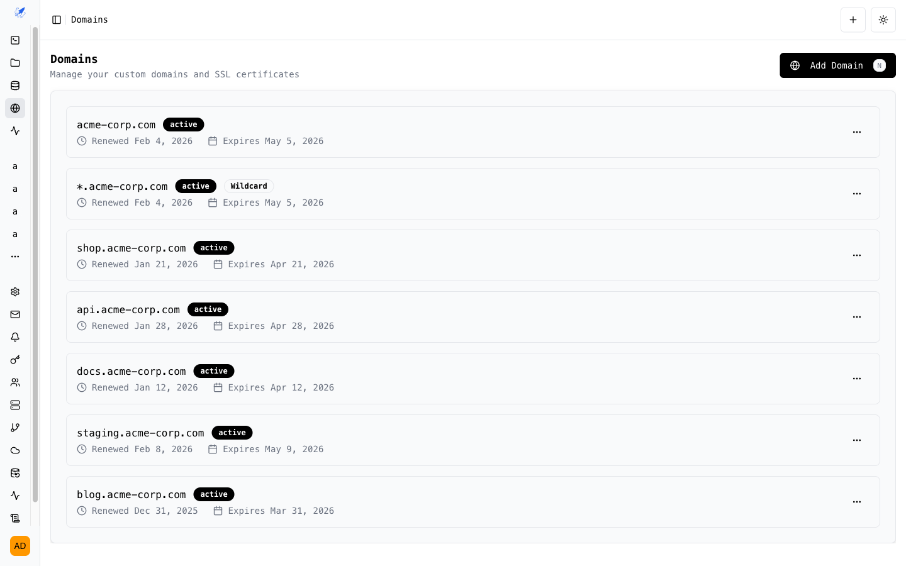
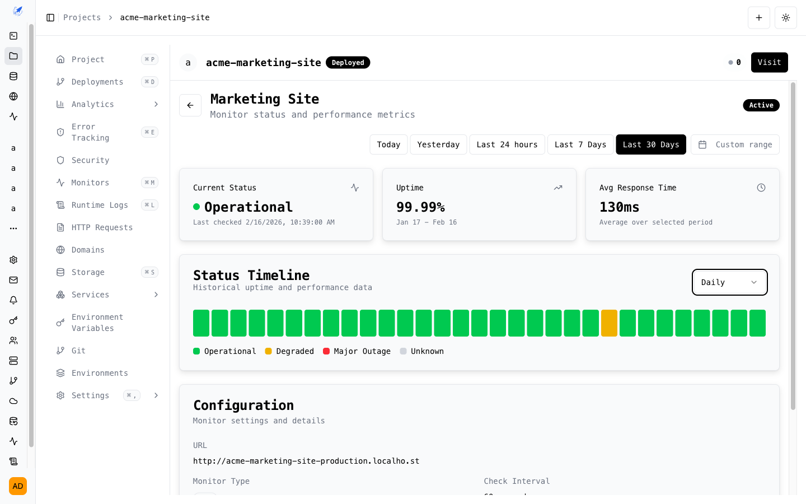
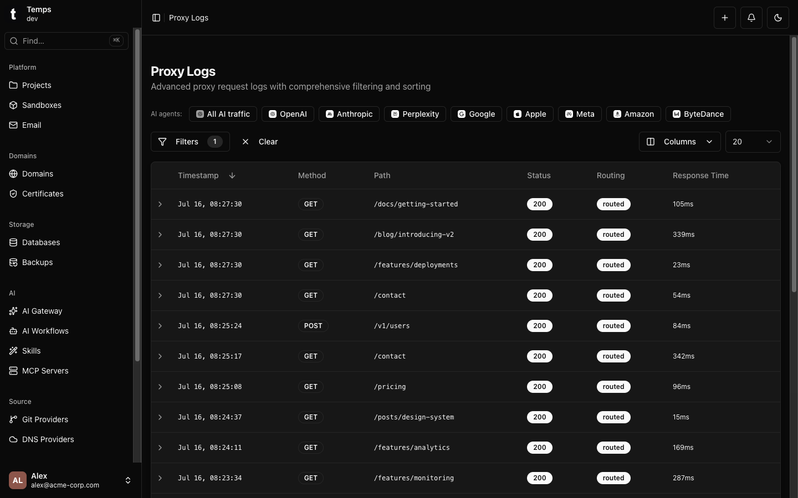
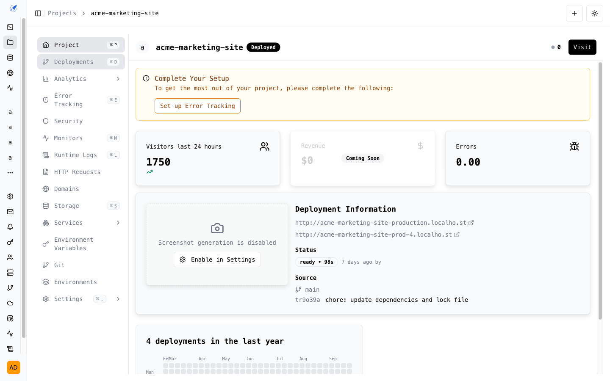

<div align="center">

<picture>
  <source media="(prefers-color-scheme: dark)" srcset="web/public/logo/temps-logo-dark.png">
  <source media="(prefers-color-scheme: light)" srcset="web/public/logo/temps-logo-light.png">
  
</picture>

### The open-source, self-hosted deployment platform.
### Deploy, observe, and scale -- from a single binary.

[](LICENSE)
[](https://github.com/gotempsh/temps/releases)
[](https://www.rust-lang.org/)
[](https://github.com/gotempsh/temps)

[Website](https://temps.sh) | [Documentation](https://temps.sh/docs) | [Quick Start](https://temps.sh/docs/introduction) | [GitHub](https://github.com/gotempsh/temps)

</div>

---

<p align="center">
  
  <br />
  <em>From bare server to fully deployed — in under 3 minutes (166s).</em>
</p>

```bash
curl -fsSL https://temps.sh/deploy.sh | bash
```



Stop paying for 6 different SaaS tools. Temps replaces your deployment platform, analytics, error tracking, session replay, uptime monitoring, and transactional email -- all self-hosted, all in one binary.

---

## Features

<table>
<tr>
<td width="50%">

**Git Push to Deploy**
Push to Git, Temps builds and deploys. Auto-detects frameworks, creates preview URLs, and handles zero-downtime rollouts.



</td>
<td width="50%">

**Built-in Analytics & Session Replay**
Web analytics with funnels, visitor tracking, and session replay (rrweb). Sentry-compatible error tracking. No external services.



</td>
</tr>
<tr>
<td width="50%">

**Pingora-Powered Proxy**
Runs on Cloudflare's Pingora engine. Auto TLS via Let's Encrypt (HTTP-01 & DNS-01), custom domains, and full request logging.



</td>
<td width="50%">

**Managed Services**
Provision Postgres, Redis, S3 (MinIO), and MongoDB alongside your apps. Temps handles creation, backups, and teardown.



</td>
</tr>
<tr>
<td width="50%">

**Request Logs & Proxy Visibility**
Every HTTP request logged with method, path, status, response time, and routing metadata. Filter and search without extra tooling.



</td>
<td width="50%">

**Monitoring & Alerts**
Monitors for deploy failures, runtime crashes, certificate expiry, and backup health. Get notified before problems reach users.



</td>
</tr>
<tr>
<td width="50%">

**Transactional Email**
Add sender domains with DKIM records through the UI. Send transactional emails via `@temps-sdk/node-sdk`. No external email service needed.

</td>
<td width="50%">

**AI-Ready (MCP Server)**
Ship with a Model Context Protocol server (`@temps-sdk/mcp`) so AI agents can deploy, monitor, and manage your infrastructure through natural language.

</td>
</tr>
</table>

### Works with your stack

<p align="center">
<a href="https://nextjs.org"></a>
<a href="https://vitejs.dev"></a>
<a href="https://go.dev"></a>
<a href="https://python.org"></a>
<a href="https://rust-lang.org"></a>
<a href="https://java.com"></a>
<a href="https://dotnet.microsoft.com"></a>
<a href="https://nestjs.com"></a>
<a href="https://docker.com"></a>
</p>

<p align="center"><em>Any language, any framework. Auto-detected or bring your own Dockerfile.</em></p>

---

## Quick Start

```bash
curl -fsSL https://temps.sh/deploy.sh | bash
```

**Tested on:** Ubuntu 24.04 / 22.04 &nbsp;|&nbsp; Also works on macOS

---

## What Temps replaces

| What you get | Instead of paying for |
|---|---|
| Git deployments + preview URLs | Vercel / Netlify / Railway ($20+/mo) |
| Web analytics + funnels | PostHog / Plausible ($0-450/mo) |
| Session replay | PostHog / FullStory ($0-2000/mo) |
| Error tracking | Sentry ($26+/mo) |
| Uptime monitoring | Better Uptime / Pingdom ($20+/mo) |
| Managed Postgres/Redis/S3 | AWS RDS / ElastiCache ($50+/mo) |
| Transactional email + DKIM | Resend / SendGrid ($20-100/mo) |
| Request logs + proxy | Cloudflare ($0-200/mo) |
| **Total with Temps** | **$0 (self-hosted)** |

---

## Temps vs. Alternatives

| Feature | Temps | Coolify | Dokploy | CapRover | Dokku | Railway | Vercel |
|---|:---:|:---:|:---:|:---:|:---:|:---:|:---:|
| Self-hosted | Yes | Yes | Yes | Yes | Yes | No | No |
| Single binary install | Yes | No | No | No | No | -- | -- |
| Git push deploy | Yes | Yes | Yes | Yes | Yes | Yes | Yes |
| Multi-node / clustering | No | Yes | Yes | Yes | No | Yes | Yes |
| Web analytics | Yes | No | No | No | No | Yes | Yes |
| Session replay | Yes | No | No | No | No | No | No |
| Error tracking (Sentry-compatible) | Yes | No | No | No | No | No | No |
| Uptime monitoring | Yes | No | No | No | No | No | No |
| Transactional email + DKIM | Yes | No | No | No | No | No | No |
| Managed Postgres/Redis/S3 | Yes | Yes | Yes | Partial | Plugin | Yes | Add-on |
| Pingora proxy (Cloudflare-grade) | Yes | No | No | No | No | No | No |
| Auto TLS (HTTP-01 + DNS-01) | Yes | Yes | Yes | Yes | Plugin | Yes | Yes |
| Request-level logging | Yes | No | No | No | No | Partial | Partial |
| Preview deployments | Yes | Yes | Yes | No | No | Yes | Yes |
| Built with Rust | Yes | No | No | No | No | No | No |
| Free & open source | Yes | Yes | Yes | Yes | Yes | No | No |

---

## Tech Stack

- **Backend:** Rust, Axum, Sea-ORM, Pingora (Cloudflare's proxy engine), Bollard (Docker API)
- **Frontend:** React 19, TypeScript, Tailwind CSS, shadcn/ui
- **Database:** PostgreSQL + TimescaleDB
- **Architecture:** 30+ workspace crates, three-layer service architecture

---

## SDKs

| Package | Description |
|---|---|
| [`@temps-sdk/node-sdk`](https://www.npmjs.com/package/@temps-sdk/node-sdk) | Platform API client + Sentry-compatible error tracking |
| [`@temps-sdk/react-analytics`](https://www.npmjs.com/package/@temps-sdk/react-analytics) | React analytics, session replay, Web Vitals, engagement tracking |
| [`@temps-sdk/kv`](https://www.npmjs.com/package/@temps-sdk/kv) | Serverless key-value store |
| [`@temps-sdk/blob`](https://www.npmjs.com/package/@temps-sdk/blob) | File storage (S3-compatible) |
| [`@temps-sdk/cli`](https://www.npmjs.com/package/@temps-sdk/cli) | Command-line interface |
| [`@temps-sdk/mcp`](https://www.npmjs.com/package/@temps-sdk/mcp) | Model Context Protocol server for AI agents |

<details>
<summary><strong>Quick examples</strong></summary>

**Analytics** -- wrap your React app, everything else is automatic:

```tsx
import { TempsAnalyticsProvider } from '@temps-sdk/react-analytics';

export default function App({ children }) {
  return <TempsAnalyticsProvider>{children}</TempsAnalyticsProvider>;
}
```

**Error tracking** -- Sentry-compatible, drop-in replacement:

```typescript
import { ErrorTracking } from '@temps-sdk/node-sdk';

ErrorTracking.init({ dsn: 'https://key@your-instance.temps.dev/1' });

try {
  riskyOperation();
} catch (error) {
  ErrorTracking.captureException(error);
}
```

**KV store** -- Redis-like API, zero config:

```typescript
import { kv } from '@temps-sdk/kv';

await kv.set('user:123', { name: 'Alice', plan: 'pro' }, { ex: 3600 });
const user = await kv.get('user:123');
```

**Blob storage** -- upload and serve files:

```typescript
import { blob } from '@temps-sdk/blob';

const { url } = await blob.put('avatars/user-123.png', fileBuffer);
const files = await blob.list({ prefix: 'avatars/' });
```

</details>

---

## Contributing

We welcome contributions. See [CONTRIBUTING.md](CONTRIBUTING.md) for guidelines.

```bash
git clone https://github.com/gotempsh/temps.git
cd temps
cargo build --release
```

---

## License

Dual-licensed under [MIT](LICENSE-MIT) or [Apache 2.0](LICENSE).

---

<div align="center">

[temps.sh](https://temps.sh) | [Documentation](https://temps.sh/docs) | [GitHub](https://github.com/gotempsh/temps)

</div>
