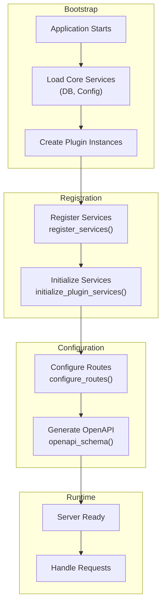
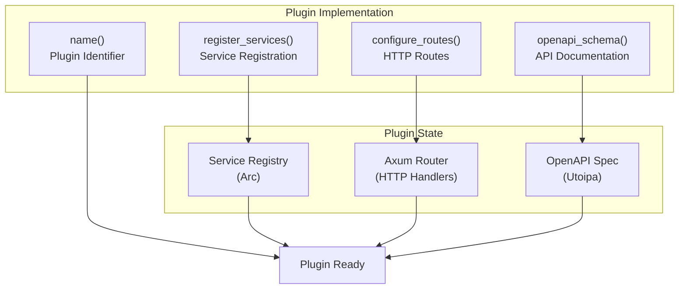
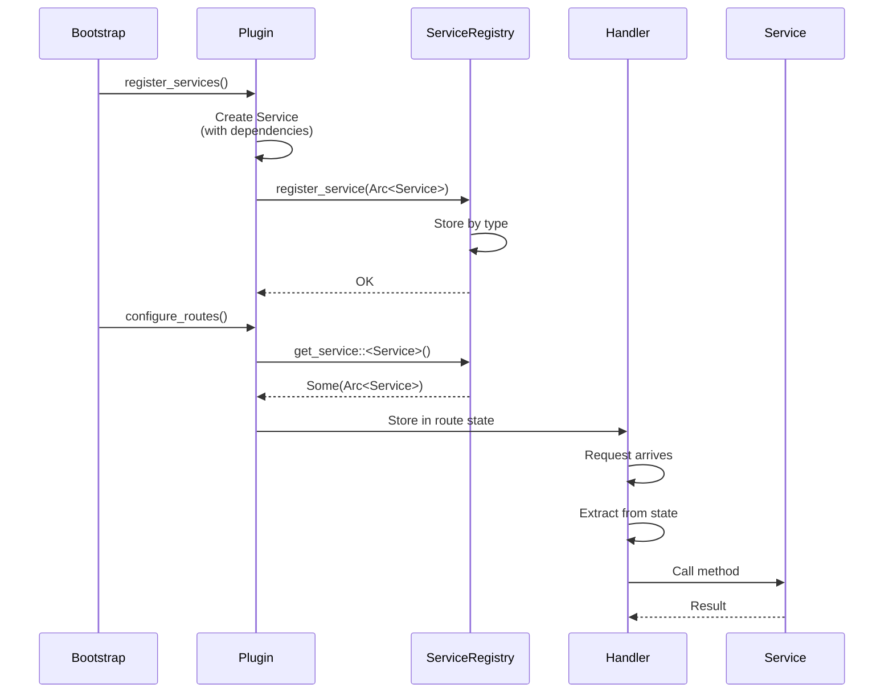
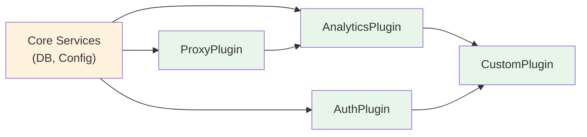
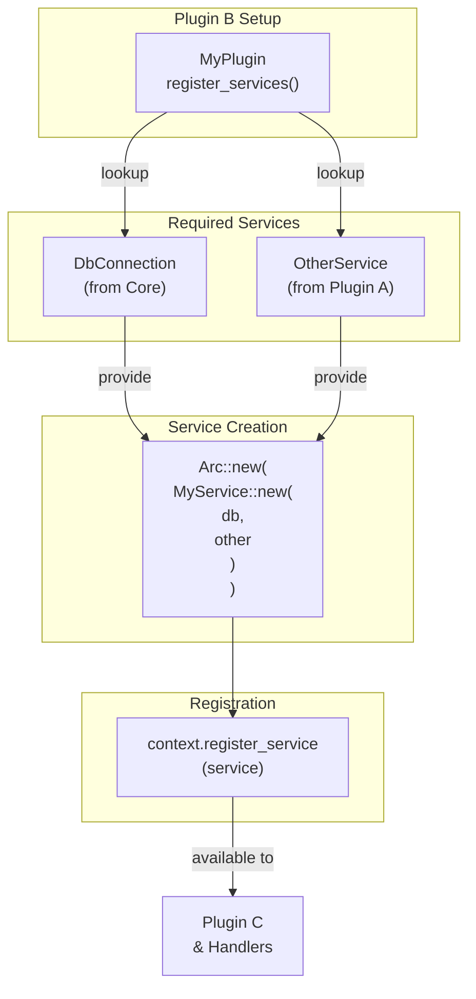

export const metadata = {
  title: 'Plugin System',
  description: 'Learn how the Temps plugin system works. Extend platform functionality with service registration, route configuration, and custom integrations.',
  alternates: {
    canonical: '/docs/plugins',
  },
}

export const sections = [
  { title: 'Overview', id: 'overview' },
  { title: 'Plugin Architecture', id: 'architecture' },
  { title: 'Key Plugins', id: 'key-plugins' },
  { title: 'Service Registration', id: 'service-registration' },
  { title: 'Route Configuration', id: 'route-configuration' },
]

# Plugin System

Temps uses a modular plugin architecture that enables extensibility without modifying core code. All functionality is organized as plugins implementing the `TempsPlugin` trait. {{ className: 'lead' }}

---

## Overview {{ anchor: true, id: 'overview' }}

The plugin system provides a clean separation of concerns, allowing features to be developed, tested, and maintained independently.

### Key Benefits

<Properties>
  <Property name="Modularity">
    Each plugin is self-contained with its own services, routes, and configuration
  </Property>
  <Property name="Extensibility">
    Add new features without modifying core Temps code
  </Property>
  <Property name="Type Safety">
    Type-safe dependency injection through the service registry
  </Property>
  <Property name="Testability">
    Plugins can be tested in isolation with mocked dependencies
  </Property>
  <Property name="OpenAPI Integration">
    Automatic API documentation generation from plugin routes
  </Property>
</Properties>

### Plugin Lifecycle



---

## Plugin Architecture {{ anchor: true, id: 'architecture' }}

### The TempsPlugin Trait

All plugins implement the `TempsPlugin` trait, which defines four core methods:

```rust
pub trait TempsPlugin: Send + Sync {
    /// Unique identifier for this plugin
    fn name(&self) -> &'static str;

    /// Register services that this plugin provides
    fn register_services(
        &self,
        context: &ServiceRegistrationContext,
    ) -> Result<(), PluginError>;

    /// Configure HTTP routes for this plugin
    fn configure_routes(&self, context: &PluginContext) -> Option<PluginRoutes>;

    /// Contribute to global OpenAPI schema
    fn openapi_schema(&self) -> Option<OpenApi>;
}
```

### Plugin Components



### Service Registration Flow



---

## Key Plugins {{ anchor: true, id: 'key-plugins' }}

Temps includes 40+ plugins that provide core functionality:

<Properties>
  <Property name="ProxyPlugin">
    HTTP/HTTPS request routing, load balancing, and analytics collection
  </Property>
  <Property name="DeployerPlugin">
    Container building, CI/CD pipeline, and deployment management
  </Property>
  <Property name="DomainsPlugin">
    DNS management and TLS certificate provisioning
  </Property>
  <Property name="AnalyticsPlugin">
    Event tracking, metrics collection, and visitor analytics
  </Property>
  <Property name="AuthPlugin">
    User authentication, authorization, and session management
  </Property>
  <Property name="ErrorTrackingPlugin">
    Sentry-compatible error tracking and monitoring
  </Property>
  <Property name="BlobPlugin">
    Object storage and file management
  </Property>
  <Property name="KVPlugin">
    Key-value store for caching and state management
  </Property>
</Properties>

### Plugin Dependencies

Plugins can depend on services from other plugins:



---

## Service Registration {{ anchor: true, id: 'service-registration' }}

### Type-Safe Service Lookup

The service registry uses Rust's type system for compile-time safety:

```rust
// During plugin initialization
let service = context.get_service::<MyService>();
// Type: Option<Arc<MyService>>

// Use the service
if let Some(svc) = service {
    let result = svc.do_something().await;
}
```

### Service Dependencies

Plugins can request services from other plugins during registration:

```rust
async fn register_services(
    &self,
    context: &ServiceRegistrationContext,
) -> Result<(), PluginError> {
    // Get database connection (from core)
    let db = context.get_service::<DbConnection>()
        .ok_or_else(|| PluginError::ServiceNotFound {
            service_type: "DbConnection".to_string(),
        })?;

    // Get analytics service (from AnalyticsPlugin)
    let analytics = context.get_service::<AnalyticsService>()
        .ok_or_else(|| PluginError::ServiceNotFound {
            service_type: "AnalyticsService".to_string(),
        })?;

    // Create and register your service
    let service = Arc::new(MyService::new(db, analytics));
    context.register_service(service);

    Ok(())
}
```

### Service Registration Flow



---

## Route Configuration {{ anchor: true, id: 'route-configuration' }}

### Route Naming Convention

- **Admin APIs**: `/api/admin/*`
- **Plugin APIs**: `/api/<plugin-name>/*`
- **Public APIs**: `/api/public/*`
- **Internal APIs**: `/api/_temps/*` (Temps reserved)

### Example Route Configuration

```rust
fn configure_routes(&self, context: &PluginContext) -> Option<PluginRoutes> {
    // Get your service from registry
    let service = context.get_service::<MyService>()?;

    // Create an Axum router
    let router = axum::Router::new()
        .route("/api/my-plugin/status", axum::routing::get(status_handler))
        .route("/api/my-plugin/items", axum::routing::get(list_items))
        .with_state(Arc::new(service.clone()));

    Some(PluginRoutes::new(router))
}
```

### OpenAPI Integration

Plugins automatically contribute to the global OpenAPI schema:

```rust
fn openapi_schema(&self) -> Option<OpenApi> {
    // Define your API documentation
    Some(MyApiDoc::openapi())
}
```

All plugin schemas are merged into one global schema accessible at `/swagger-ui/`.

---

## Additional Resources

<div className="not-prose">
  <Button href="/docs/overview" variant="text" arrow="left">
    Architecture Overview
  </Button>
  <Button href="/docs/request-flow" variant="text" arrow="right">
    Request Flow
  </Button>
</div>
