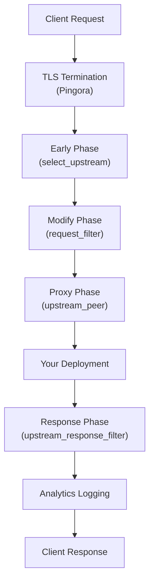
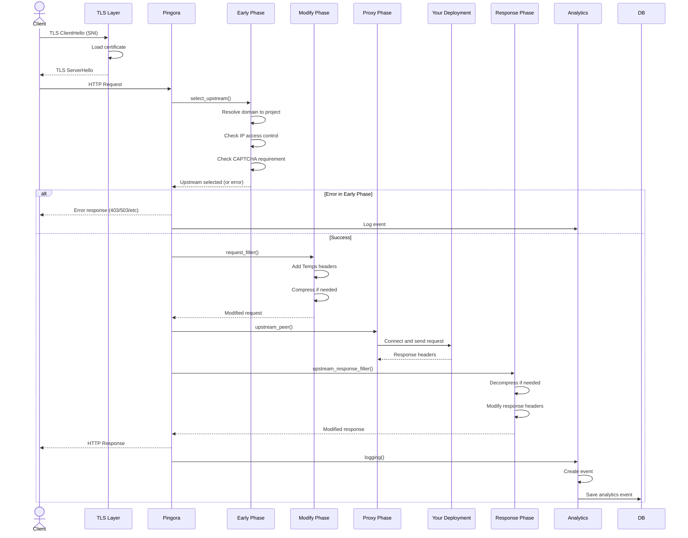
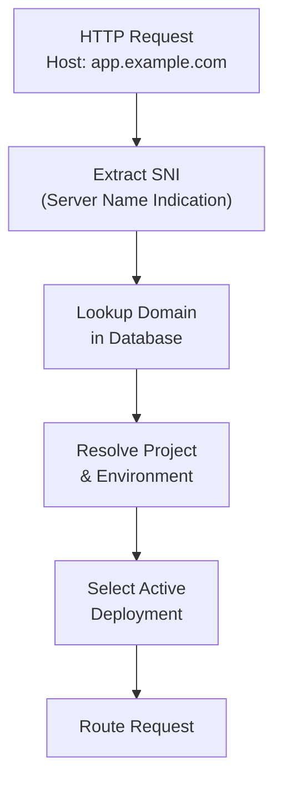
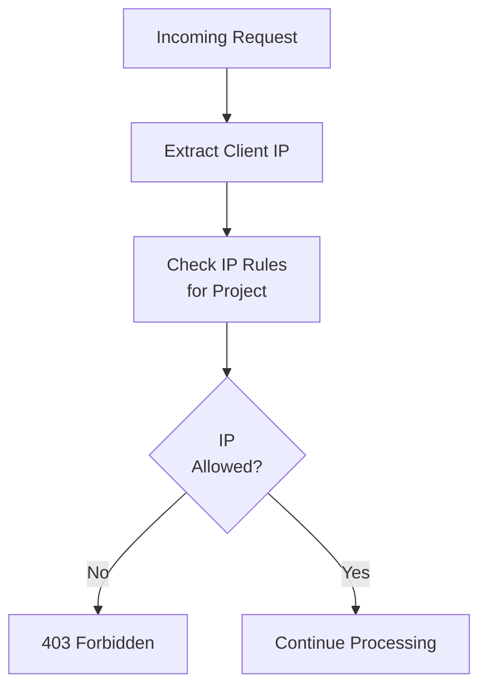
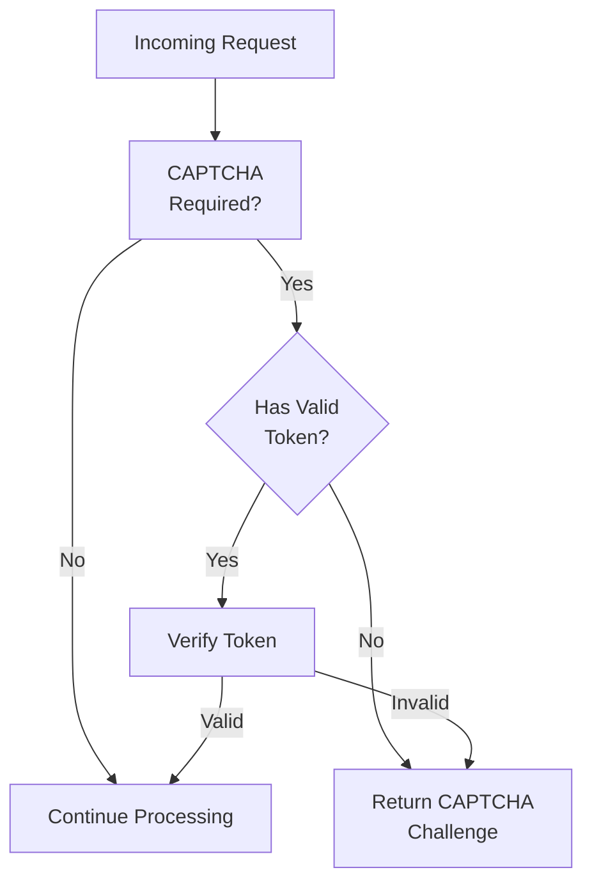

export const metadata = {
  title: 'Request Flow',
  description: 'Understanding how requests flow through Temps from client to deployment and back.',
  alternates: {
    canonical: '/docs/request-flow',
  },
}

export const sections = [
  { title: 'Overview', id: 'overview' },
  { title: 'Request Lifecycle', id: 'lifecycle' },
  { title: 'Processing Phases', id: 'phases' },
  { title: 'Project Resolution', id: 'project-resolution' },
  { title: 'Security Checks', id: 'security-checks' },
]

# Request Flow

Understanding how HTTP requests flow through Temps from the client to your deployment and back. {{ className: 'lead' }}

---

## Overview {{ anchor: true, id: 'overview' }}

Every request to your Temps-hosted application goes through a well-defined pipeline that handles TLS termination, routing, security checks, and analytics.

### High-Level Flow

---

## Request Lifecycle {{ anchor: true, id: 'lifecycle' }}

### Complete Request Flow

---

## Processing Phases {{ anchor: true, id: 'phases' }}

Temps uses Pingora's `ProxyHttp` trait, which provides 6 phases for request handling:

### Phase 1: Early (select_upstream)

**Purpose**: Determine which deployment should handle this request.

**Actions**:
- Extract hostname from request
- Resolve domain to project and environment
- Check IP access control rules
- Determine if CAPTCHA challenge is required
- Select upstream deployment

**Outcome**: Upstream selected or error returned to client.

### Phase 2: Modify (request_filter)

**Purpose**: Modify the request before forwarding.

**Actions**:
- Add Temps-specific headers (`X-Request-ID`, `X-Project-ID`, etc.)
- Extract request metadata (method, path, query string, user agent)
- Extract client IP address
- Compress request body if needed
- Set request start time for performance tracking

**Outcome**: Modified request ready for forwarding.

### Phase 3: Proxy (upstream_peer)

**Purpose**: Establish connection to your deployment.

**Actions**:
- Connect to deployment container
- Forward modified request
- Handle connection errors and timeouts

**Outcome**: Request sent to your application.

### Phase 4: Response (upstream_response_filter)

**Purpose**: Process response from your deployment.

**Actions**:
- Decompress response if needed
- Modify response headers
- Add security headers
- Handle response errors

**Outcome**: Processed response ready to send to client.

### Phase 5: Filter (response_filter)

**Purpose**: Final response modifications.

**Actions**:
- Add analytics tracking pixels (if enabled)
- Inject monitoring scripts (if enabled)
- Final header modifications

**Outcome**: Final response ready.

### Phase 6: Finish (logging)

**Purpose**: Log request for analytics and monitoring.

**Actions**:
- Create analytics event with request metadata
- Record performance metrics (response time, status code)
- Save to database for dashboard and reports

**Outcome**: Request logged and metrics recorded.

---

## Project Resolution {{ anchor: true, id: 'project-resolution' }}

### Domain to Project Mapping

When a request arrives, Temps must determine which project and environment should handle it:

### Resolution Steps

1. **Extract Hostname**: From `Host` header or TLS SNI
2. **Domain Lookup**: Query `domains` table for matching domain
3. **Project Resolution**: Get associated project and environment
4. **Deployment Selection**: Find active deployment for environment
5. **Upstream Selection**: Determine container endpoint to forward to

### Fallback Behavior

If domain resolution fails:
- Return `503 Service Unavailable` if domain not found
- Return `403 Forbidden` if domain exists but project is disabled
- Log error for debugging

---

## Security Checks {{ anchor: true, id: 'security-checks' }}

### IP Access Control

Before forwarding requests, Temps checks IP access control rules:

**IP Rules**:
- **Allow List**: Only specified IPs can access
- **Block List**: Specified IPs are denied
- **Default**: All IPs allowed (if no rules configured)

### CAPTCHA Challenge

For projects with CAPTCHA enabled, requests may be challenged:

**CAPTCHA Triggers**:
- First request from new IP
- Suspicious traffic patterns
- Rate limiting violations
- Manual enablement by project owner

### Request Headers Added

Temps automatically adds headers to requests forwarded to your deployment:

- `X-Request-ID`: Unique identifier for this request
- `X-Project-ID`: Project identifier
- `X-Environment-ID`: Environment identifier
- `X-Client-IP`: Client IP address
- `X-Forwarded-For`: Original client IP (if behind proxy)
- `X-Forwarded-Proto`: Original protocol (http/https)

---

## Additional Resources

  <Button href="/docs/overview" variant="text" arrow="left">
    Architecture Overview
  </Button>
  <Button href="/docs/plugins" variant="text" arrow="right">
    Plugin System
  </Button>

